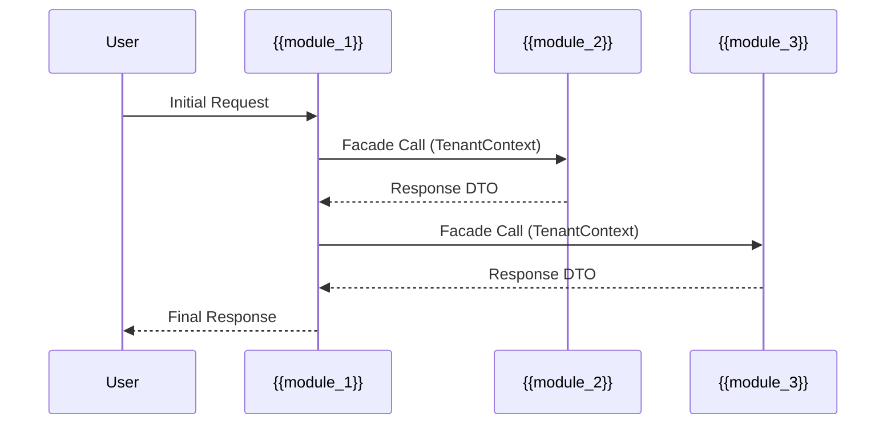

# Cross-Module Story Decomposition Template

## Purpose

Use this template to decompose user stories that span multiple modules, defining the cross-module flow, tasks per module, facade integration points, and tenant isolation verification requirements. Complete this during the cross-module-story workflow for multi-module features.

## Story Overview

| Field | Value |
|-------|-------|
| Story ID | {{story_id}} |
| Title | {{story_title}} |
| Epic | {{parent_epic}} |
| Created | {{date}} |
| Author | {{author}} |

## User Journey

**As a** {{persona}}
**I want to** {{action}}
**So that** {{benefit}}

## Modules Involved

| Module | Role | Owner | Complexity |
|--------|------|-------|------------|
| {{module_1}} | Primary | {{owner_1}} | {{complexity}} |
| {{module_2}} | Supporting | {{owner_2}} | {{complexity}} |
| {{module_3}} | Supporting | {{owner_3}} | {{complexity}} |

## Cross-Module Flow

## Decomposed Tasks

### Module: {{module_1}} (Primary)

| Task ID | Description | Dependencies | Estimate |
|---------|-------------|--------------|----------|
| {{story_id}}-M1-01 | {{task_description}} | None | {{estimate}} |
| {{story_id}}-M1-02 | {{task_description}} | M1-01 | {{estimate}} |

**Acceptance Criteria:**
- [ ] TenantContext propagated to all facade calls
- [ ] Error handling for cross-module failures
- [ ] Integration tests with module mocks

### Module: {{module_2}} (Supporting)

| Task ID | Description | Dependencies | Estimate |
|---------|-------------|--------------|----------|
| {{story_id}}-M2-01 | {{task_description}} | None | {{estimate}} |

**Acceptance Criteria:**
- [ ] Facade method accepts TenantContext
- [ ] Returns DTO (not domain entity)
- [ ] Contract test exists

### Module: {{module_3}} (Supporting)

| Task ID | Description | Dependencies | Estimate |
|---------|-------------|--------------|----------|
| {{story_id}}-M3-01 | {{task_description}} | None | {{estimate}} |

**Acceptance Criteria:**
- [ ] Facade method accepts TenantContext
- [ ] Returns DTO (not domain entity)
- [ ] Contract test exists

## Integration Points

| From | To | Facade Method | Contract Version |
|------|-----|---------------|------------------|
| {{module_1}} | {{module_2}} | {{method_name}} | v{{version}} |
| {{module_1}} | {{module_3}} | {{method_name}} | v{{version}} |

## Tenant Isolation Verification

- [ ] All cross-module calls include TenantContext
- [ ] No tenant data leaks between modules
- [ ] Audit logging captures tenant context
- [ ] Error messages don't expose other tenant data

## Convergence Checklist

- [ ] All module tasks completed
- [ ] All facade contracts have passing tests
- [ ] Integration tests pass end-to-end
- [ ] No circular dependencies introduced
- [ ] Performance acceptable (<{{sla_ms}}ms p99)

---

## Web Research Queries

Before finalizing this document, verify current best practices:

- "cross-module story decomposition best practices {date}"
- "module integration user story patterns multi-tenant SaaS {date}"
- "facade integration testing enterprise implementation {date}"

Incorporate relevant findings into the document sections above.

---

## Verification Checklist

- [ ] All modules involved in the story are identified with owners and complexity
- [ ] Cross-module sequence diagram accurately represents the interaction flow
- [ ] Tasks are decomposed per module with clear dependencies
- [ ] All facade methods accept TenantContext as required parameter
- [ ] Facade methods return DTOs, not domain entities
- [ ] Contract tests exist for each facade integration point
- [ ] Error handling covers cross-module failure scenarios
- [ ] TenantContext propagates through all cross-module calls
- [ ] Audit logging captures tenant context for all operations
- [ ] Integration tests verify end-to-end flow across modules
- [ ] Performance meets SLA requirements for cross-module latency
- [ ] No circular dependencies introduced between modules

---

## Sign-offs

| Module Owner | Approved | Date |
|--------------|----------|------|
| {{owner_1}} | [ ] | |
| {{owner_2}} | [ ] | |
| {{owner_3}} | [ ] | |

## Change Log

| Version | Date | Author | Changes |
|---------|------|--------|---------|
| {{version}} | {{date}} | {{author}} | Initial template creation |
