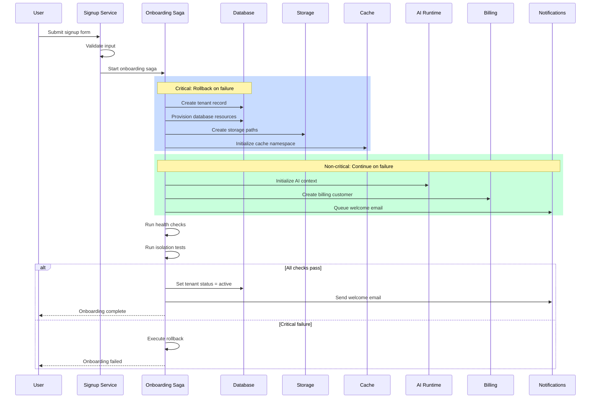

# Step 05: Compile Onboarding Design Document

## MANDATORY EXECUTION RULES (READ FIRST)

- 🛑 **NEVER generate content without user input** - Wait for explicit direction
- 📖 **CRITICAL: ALWAYS read the complete step file** before taking any action
- 🔄 **CRITICAL: When loading next step with 'C'**, ensure entire file is read
- ⏸️ **ALWAYS pause after presenting findings** and await user direction
- 🎯 **Focus ONLY on current step scope** - do not look ahead
- 🤝 **Collaboration menu required** after completing actions

## EXECUTION PROTOCOLS

- 🎯 Focus: Executive summary, sequence diagram, rollback, monitoring, final output
- 💾 Track: `stepsCompleted: [1, 2, 3, 4, 5]` when complete
- 📖 Context: All outputs from Steps 1-4
- 🚫 Do NOT: Skip document sections or omit rollback procedures
- 🔍 Use web search: Verify current documentation best practices
- ⚠️ Gate: Tenant lifecycle patterns

---


## CONTEXT BOUNDARIES:

**IN SCOPE for this step:**
- Gathering required inputs for this step
- Making design decisions within step scope
- Documenting decisions with rationale

**OUT OF SCOPE:**
- Decisions from other steps
- Implementation details
- Validation (separate mode)
## Purpose

Compile the complete tenant onboarding design document including executive summary, provisioning sequence diagram, rollback procedures, and monitoring/alerting configuration.

---

## Prerequisites

- Steps 1-4 completed: Full onboarding design ready
- **Load template:** `{project-root}/_bmad/bam/data/templates/tenant-onboarding.md`

---

## Inputs

- Output from Steps 1-4: Complete onboarding design
- Template: `{project-root}/_bmad/bam/data/templates/tenant-onboarding.md`
- Pattern registry outputs for reference

---

## Actions

### 1. Write Executive Summary

Compile key decisions and rationale:

| Section | Content |
|---------|---------|
| Purpose | Tenant onboarding design for {project_name} |
| Tenant Model | {tenant_model} with {isolation_level} isolation |
| Tier Support | Free, Pro, Enterprise with tier-specific provisioning |
| Key Decisions | Saga orchestration, lazy/eager strategy, resource pools |
| Success Metrics | 99% provision success, <30s time-to-provision |

#### Executive Summary Template

```markdown
## Executive Summary

This document defines the tenant onboarding design for {{project_name}}.

### Key Decisions

1. **Tenant Model**: {{tenant_model}} providing {{isolation_benefits}}
2. **Provisioning Strategy**: {{provisioning_strategy}} for optimal {{strategy_benefit}}
3. **Saga Orchestration**: {{saga_steps}} steps with automatic rollback
4. **Validation**: Health checks + isolation tests before activation

### Success Criteria

- Provisioning success rate: >99%
- Time to provision: <30 seconds
- Isolation test pass rate: 100%
- Time to first value: <5 minutes
```

### 2. Create Provisioning Sequence Diagram

Generate Mermaid sequence diagram:



### 3. Document Rollback Procedures for Failed Provisioning

| Saga Step | Compensating Action | Order | Timeout |
|-----------|---------------------|-------|---------|
| Create tenant record | DELETE from tenants | Last | 5s |
| Provision database | DROP SCHEMA/DATABASE | 5 | 30s |
| Create storage paths | DELETE bucket/path | 4 | 10s |
| Initialize cache | FLUSHDB namespace | 3 | 5s |
| Create admin user | DELETE user | 2 | 5s |
| Initialize AI context | DELETE vector namespace | 1 | 10s |

#### Rollback Trigger Matrix

| Failure Point | Rollback Scope | User Message |
|---------------|----------------|--------------|
| Tenant record creation | None | "Unable to create account. Please try again." |
| Database provisioning | Tenant record | "Setup failed. Our team has been notified." |
| Storage provisioning | DB + Tenant | "Setup failed. Our team has been notified." |
| Admin user creation | Storage + DB + Tenant | "Account setup incomplete. Please retry." |
| Billing setup | Full rollback or manual | "Billing setup pending. Continue anyway?" |

#### Orphan Cleanup Job

| Condition | Action | Frequency |
|-----------|--------|-----------|
| status = 'pending' > 1 hour | Run rollback | Hourly |
| status = 'failed' > 24 hours | Archive + notify | Daily |
| Partial resources, no tenant | Cleanup resources | Hourly |

### 4. Define Monitoring and Alerting for Onboarding Failures

| Metric | Alert Threshold | Severity | Escalation |
|--------|-----------------|----------|------------|
| provisioning_failure_rate | > 1% (5min) | Critical | PagerDuty |
| provisioning_duration_p99 | > 60s | Warning | Slack |
| isolation_test_failures | > 0 | Critical | PagerDuty |
| health_check_failures | > 5% | Warning | Slack |
| rollback_triggered | > 5 (1hour) | High | Slack + Ticket |
| orphan_tenants_count | > 10 | Warning | Daily report |

#### Dashboard Panels

| Panel | Visualization | Data Source |
|-------|---------------|-------------|
| Signup funnel | Funnel chart | Analytics |
| Provisioning success | Gauge | Metrics |
| Time to provision | Histogram | Metrics |
| Active sagas | Counter | State DB |
| Failures by step | Bar chart | Logs |
| Rollbacks today | Counter | Metrics |

#### Alert Runbooks

| Alert | Runbook | First Response |
|-------|---------|----------------|
| High failure rate | Check infra health | Verify DB/storage available |
| Slow provisioning | Check resource pools | Replenish warm pool |
| Isolation failure | Immediate investigation | Block new signups |
| Multiple rollbacks | Pattern analysis | Identify common failure |

### 5. Compile Final Document

Assemble complete document with sections:

1. Executive Summary
2. Tenant Model and Tier Configuration
3. Registration and Signup Flow
4. Provisioning Saga Design
5. Resource Initialization
6. Validation and Health Checks
7. Rollback Procedures
8. Monitoring and Alerting
9. Appendices (sequence diagrams, code references)

**Output location:** `{output_folder}/planning-artifacts/tenant-onboarding-design.md`

**Verify current best practices with web search:**
Search the web: "SaaS onboarding documentation best practices {date}"
Search the web: "saga rollback patterns distributed systems {date}"
Search the web: "onboarding monitoring dashboards SaaS {date}"

_Source: [URL]_

---

## COLLABORATION MENUS (A/P/C):

After compiling the document, present the user with:

```
Your options:
- **A (Advanced Elicitation)**: Deep dive into specific sections or diagrams
- **P (Party Mode)**: Bring documentation reviewer and ops perspectives
- **C (Continue)**: Accept document and complete Create workflow
- **[Specific refinements]**: Describe documentation improvements

Select an option:
```

### PROTOCOL INTEGRATION:

#### If 'A' (Advanced Elicitation):
- Invoke the `bmad-advanced-elicitation` skill
- Pass context: complete document, sequence diagrams, rollback procedures
- Process enhanced insights on documentation completeness
- Ask user: "Accept this detailed document analysis? (y/n)"
- If yes, integrate improvements
- Return to A/P/C menu

#### If 'P' (Party Mode):
- Invoke the `bmad-party-mode` skill
- Context: "Review tenant onboarding design document for completeness"
- Process technical writer, SRE, and architect perspectives
- Present synthesized recommendations
- Ask user: "Accept these recommendations? (y/n)"
- Return to A/P/C menu

#### If 'C' (Continue):
- Save final document to output location
- Update frontmatter `stepsCompleted: [1, 2, 3, 4, 5]`
- Mark Create workflow complete

---

## Verification

- [ ] Executive summary captures key decisions
- [ ] Sequence diagram accurately represents flow
- [ ] Rollback procedures cover all saga steps
- [ ] Monitoring alerts defined with thresholds
- [ ] Document saved to correct location
- [ ] All cross-references valid
- [ ] Patterns align with pattern registry

---

## Outputs

- Complete tenant onboarding design document
- Output location: `{output_folder}/planning-artifacts/tenant-onboarding-design.md`

---

## Workflow Complete

Create mode is complete. 

**Next steps:**
- Run **Validate mode** (`step-20-v-*`) to verify design completeness
- Or proceed to implementation with the design document

**Related workflows:**
- `bmad-bam-tenant-offboarding` - Design tenant deprovisioning
- `bmad-bam-tenant-isolation` - Configure isolation in detail
- `bmad-bam-billing` - Detailed billing setup

---

## SUCCESS METRICS:

- [ ] All required inputs gathered from user
- [ ] Design decisions documented with rationale
- [ ] User confirmed choices via A/P/C menu
- [ ] Output artifact updated with step content
- [ ] Frontmatter stepsCompleted updated

## FAILURE MODES:

- **Missing input:** Cannot proceed without required context - return to prerequisites
- **Unclear requirements:** Use Advanced Elicitation (A) to clarify
- **Conflicting constraints:** Use Party Mode (P) for multi-perspective analysis
- **User rejects output:** Iterate on design, do not force acceptance
