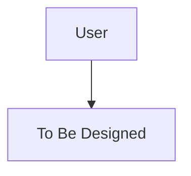

# Nova Runtime Preferences Sidecar

This file tracks AI runtime decisions made during this project. Nova loads this on activation to maintain context across sessions.

## Orchestration Framework

| Setting | Value | Rationale |
|---------|-------|-----------|
| Framework | - | - |
| State persistence | - | - |
| Multi-agent pattern | - | - |

## Tool Registry Decisions

| Tool | Module | Tier | Approval Required | Notes |
|------|--------|------|-------------------|-------|
| - | - | - | - | - |

## Memory Architecture

| Tier | Storage | TTL | Status |
|------|---------|-----|--------|
| Session | Redis | Request | - |
| User | Mem0 | - days | - |
| Tenant | Mem0 | - days | - |
| Global | Mem0 | Permanent | - |

## Safety Configuration

| Component | Status | Notes |
|-----------|--------|-------|
| Guardrails | - | - |
| Kill switches | - | - |
| Approval workflows | - | - |
| Circuit breakers | - | - |

## Agent Topology

<!-- Mermaid diagram of agent topology -->

## Runtime Gate Status

- [ ] Agent runtime architecture designed
- [ ] Tool registry complete
- [ ] Memory tiers configured
- [ ] Safety infrastructure in place
- [ ] QG-M3 (Agent Runtime) passed

---

*This sidecar is persisted at `{project-root}/_bmad/_memory/nova-sidecar/runtime-preferences.md`*
