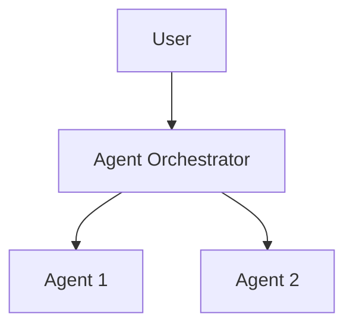

# BAM Architecture Decisions Sidecar

## Purpose

Use this sidecar template to persist architecture decisions across agent sessions. The BAM-extended architect loads this file on activation to maintain continuity of tenant model, module boundary, and isolation decisions made in previous sessions.

This file tracks all BAM-related architecture decisions made during this project. 
Winston (Architect) with BAM extension loads this on activation to maintain context across sessions.

**Persisted at:** `{project-root}/_bmad/_memory/bam-architect-sidecar/architecture-decisions.md`

---

## Platform Architecture Decisions

### Tenant Model

| Decision | Choice | Rationale | Date |
|----------|--------|-----------|------|
| Tenant hierarchy | - | - | - |
| Billing entity | - | - | - |
| Isolation level | - | - | - |

### Module Boundaries

| Module | Bounded Context | Owner | Complexity | Status |
|--------|-----------------|-------|------------|--------|
| - | - | - | - | - |

### Isolation Strategy

| Asset Type | Strategy | Implementation | Verified |
|------------|----------|----------------|----------|
| Database | - | - | [ ] |
| Cache | - | - | [ ] |
| Memory | - | - | [ ] |
| Files | - | - | [ ] |

### Architecture Decision Records (ADRs)

<!-- Link to ADRs created during this project -->
- None yet

### Foundation Gate Status (QG-F1)

- [ ] Master architecture created
- [ ] Tenant model defined
- [ ] Isolation matrix complete
- [ ] Control-plane separated
- [ ] Observability designed
- [ ] Foundation gate passed

---

## AI Runtime Architecture Decisions

### Orchestration Framework

| Setting | Value | Rationale |
|---------|-------|-----------|
| Framework | - | - |
| State persistence | - | - |
| Multi-agent pattern | - | - |

### Tool Registry

| Tool | Module | Tier | Approval Required | Notes |
|------|--------|------|-------------------|-------|
| - | - | - | - | - |

### Memory Architecture

| Tier | Storage | TTL | Status |
|------|---------|-----|--------|
| Session | Redis | Request | - |
| User | Mem0 | - days | - |
| Tenant | Mem0 | - days | - |
| Global | Mem0 | Permanent | - |

### Safety Configuration

| Component | Status | Notes |
|-----------|--------|-------|
| Guardrails | - | - |
| Kill switches | - | - |
| Approval workflows | - | - |
| Circuit breakers | - | - |

### Agent Topology

### AI Runtime Gate Status (QG-M3)

- [ ] Agent runtime architecture designed
- [ ] Tool registry complete
- [ ] Memory tiers configured
- [ ] Safety infrastructure in place
- [ ] QG-M3 (Agent Runtime) passed

---

## Integration Architecture Decisions

### Published Contracts

| Contract | Provider | Consumer(s) | Version | Status |
|----------|----------|-------------|---------|--------|
| - | - | - | - | - |

### Contract Evolution History

| Contract | Change | From Version | To Version | Date | Migration |
|----------|--------|--------------|------------|------|-----------|
| - | - | - | - | - | - |

### Dependency Matrix

| Module | Depends On | Circular? | Status |
|--------|------------|-----------|--------|
| - | - | - | - |

### Cross-Module Stories

| Story | Modules Involved | Decomposition Status |
|-------|------------------|---------------------|
| - | - | - |

### Convergence Verification Log

| Milestone | Date | Status | Issues |
|-----------|------|--------|--------|
| - | - | - | - |

### Integration Gate Status (QG-I1)

- [ ] All contracts versioned with semver
- [ ] No circular dependencies
- [ ] All contracts have tests
- [ ] Cross-module stories decomposed
- [ ] QG-I1 (Facade Compatibility) passed

---

## Cross-Domain Notes

<!-- Record any decisions that span multiple domains -->

---

## Web Research Queries

Before finalizing this document, verify current best practices:

- "multi-tenant architecture patterns {date}"
- "modular monolith design best practices {date}"
- "tenant isolation strategies SaaS platforms {date}"
- "architecture decision records enterprise {date}"

Incorporate relevant findings. _Source: [URL]_

---

## Verification Checklist

- [ ] All tenant model decisions documented with rationale
- [ ] Module boundaries clearly defined and consistent
- [ ] Isolation strategy specified for all asset types
- [ ] Architecture Decision Records (ADRs) linked or created
- [ ] Foundation Gate (QG-F1) checklist reviewed
- [ ] Agent Runtime Gate (QG-M3) checklist reviewed
- [ ] Integration Gate (QG-I1) checklist reviewed
- [ ] Multi-tenant isolation verified for all components
- [ ] Contract versioning follows semver conventions
- [ ] Cross-domain dependencies identified and documented
- [ ] Sidecar synced with latest session decisions
- [ ] No stale or contradictory decisions remain

---

## Change Log

| Version | Date | Author | Changes |
|---------|------|--------|---------|
| {{version}} | {{date}} | {{author}} | Initial template creation |

---

*Last updated: {{date}}*
