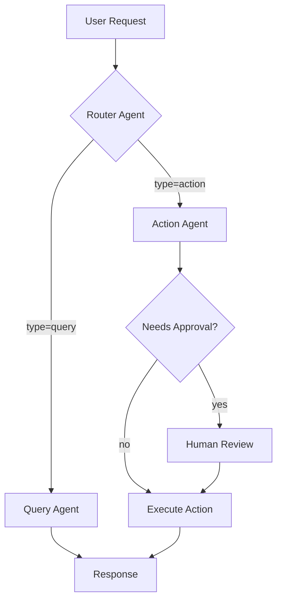

# BAM AI Runtime Preferences Sidecar

## Purpose

Use this sidecar template to persist AI runtime configuration decisions. The BAM-extended architect loads this when working on agent orchestration, tool registry, memory tiers, and safety infrastructure to maintain consistency across sessions.

This file tracks AI runtime decisions made during this project.
Winston (Architect) with BAM extension loads this when working on AI runtime tasks.

**Persisted at:** `{project-root}/_bmad/_memory/bam-architect-sidecar/runtime-preferences.md`

---

## Orchestration Framework

| Setting | Value | Rationale |
|---------|-------|-----------|
| Framework | LangGraph / CrewAI / AutoGen | - |
| State persistence | Redis / PostgreSQL | - |
| Multi-agent pattern | Single / Router / Hierarchical | - |

## Tool Registry

| Tool | Module | Tier | Approval Required | Rate Limit | Notes |
|------|--------|------|-------------------|------------|-------|
| - | - | read/write/admin/dangerous | yes/no | /min | - |

## Memory Architecture

| Tier | Storage | TTL | Write Rules | Status |
|------|---------|-----|-------------|--------|
| Session | Redis | Request duration | Agent only | - |
| User | Mem0 | 30-90 days | With consent | - |
| Tenant | Mem0 | 90 days | Admin approval | - |
| Global | Mem0 | Permanent | System only | - |

## Safety Configuration

| Component | Implementation | Status | Notes |
|-----------|----------------|--------|-------|
| Input guardrails | NeMo / Custom | - | - |
| Output guardrails | NeMo / Custom | - | - |
| Kill switches | Feature flags | - | - |
| Approval workflows | Custom / Built-in | - | - |
| Circuit breakers | Resilience4j | - | - |
| Budget enforcement | Run contract | - | - |

## Agent Topology



## Run Contract Defaults

```yaml
default_run_contract:
  max_tokens: 10000
  max_cost_usd: 0.50
  max_duration_seconds: 300
  allowed_tools: []  # Populated per agent
  success_criteria: "task_completed"
```

## QG-M3 (Agent Runtime) Checklist

- [ ] Agent runtime architecture designed (ARA workflow)
- [ ] Tool registry complete with all tools classified
- [ ] Memory tiers configured with isolation
- [ ] Safety infrastructure in place (guardrails, kill switches)
- [ ] Run contract templates defined
- [ ] Approval workflow configured for risky actions
- [ ] QG-M3 checklist passed

---

## Web Research Queries

Before finalizing this document, verify current best practices:

- "AI agent orchestration frameworks {date}"
- "LLM tool registry multi-tenant patterns {date}"
- "agent memory architecture best practices {date}"
- "AI safety guardrails enterprise implementation {date}"

Incorporate relevant findings. _Source: [URL]_

---

## Verification Checklist

- [ ] Orchestration framework selection documented with rationale
- [ ] All tools registered with tier and approval requirements
- [ ] Memory architecture defined for all tiers (Session, User, Tenant, Global)
- [ ] Safety components configured (guardrails, kill switches, circuit breakers)
- [ ] Agent topology diagram reflects current design
- [ ] Run contract defaults are appropriate for use case
- [ ] Multi-tenant isolation enforced at all memory tiers
- [ ] Rate limits configured per tool and per tier
- [ ] Budget enforcement mechanisms in place
- [ ] Approval workflows defined for dangerous tools
- [ ] QG-M3 checklist items all addressed
- [ ] Sidecar reflects latest session preferences

---

*Last updated: {{date}}*

## Change Log

| Version | Date | Author | Changes |
|---------|------|--------|---------|
| {{version}} | {{date}} | {{author}} | Initial template creation |
