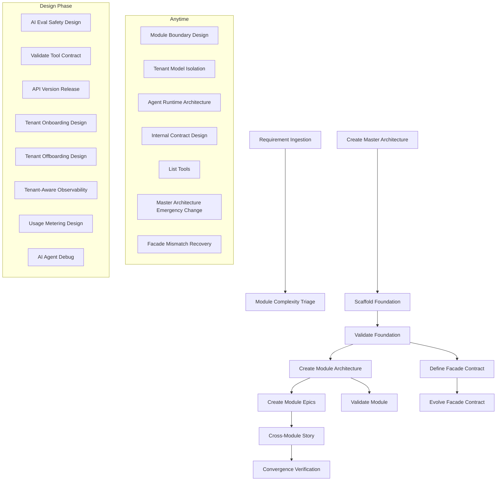

# BAM Workflow Sequence (DAG)

> Defines the execution order and dependencies between BAM workflows.
> See also: [bam-index.csv](bam-index.csv), [section-reference-map.md](section-reference-map.md)

## Workflow Dependency Graph

## Execution Phases

| Phase                      | Workflows                                                    | Gate                    |
| -------------------------- | ------------------------------------------------------------ | ----------------------- |
| 1-analysis                 | RI → MCT                                                     | —                       |
| 3-solutioning (foundation) | CMAR → SF → VF                                               | QG-M1 (Foundation Gate) |
| 3-solutioning (module)     | DFC, CMA → CME, CMA → VM, VTC, AVR, AES, TOD, TOFD, TAO, UMD | QG-M2, QG-M3            |
| 4-implementation           | EFC, CMS, AAD, CV                                            | QG-I2, QG-I3            |
| anytime                    | MBD, TMI, ARA, ICD, LT, MAEC, FCMR                           | —                       |

## Critical Path

The critical path for a new BAM project is:

1. **RI** → **MCT** (understand scope)
2. **CMAR** → **SF** → **VF** (establish foundation, pass QG-M1)
3. **DFC** + **CMA** (define contracts and module architecture in parallel)
4. **CME** → **VM** (create stories, validate module)
5. **CMS** → **CV** (cross-module integration, convergence verification)

## Gate Dependencies

- **QG-M1** (Foundation Gate): Must pass before CMA, CME, VM, DFC
- **QG-M2** (Tenant Isolation): Must pass before QG-I2
- **QG-M3** (Agent Runtime): Must pass before QG-I3
- **QG-I2** (Tenant Safety): Must pass before release
- **QG-I3** (Agent Safety): Must pass before release
- **QG-R1** (Production Readiness): Final release gate
