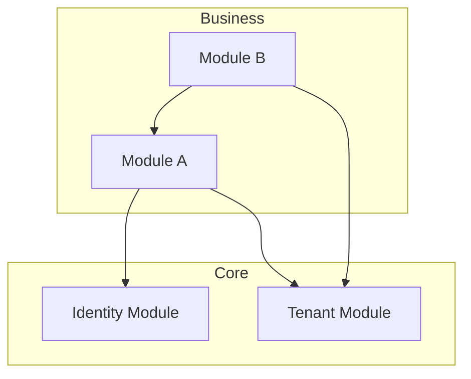

# Step 5: Document Dependencies

## MANDATORY EXECUTION RULES (READ FIRST):

- 🛑 NEVER generate content without user input
- 📖 CRITICAL: ALWAYS read the complete step file before taking any action
- 🔄 CRITICAL: When loading next step with 'C', ensure entire file is read
- ⏸️ ALWAYS pause after presenting findings and await user direction
- 🎯 Focus ONLY on current step scope - do not look ahead

## EXECUTION PROTOCOLS:

- 🎯 Show your analysis before taking any action
- 💾 Update document frontmatter after each section completion
- 📝 Maintain append-only document building
- ✅ Track progress in `stepsCompleted` array
- 🔍 Use web search to verify current best practices when making technology decisions
- 📎 Reference pattern registry `web_queries` for search topics

---

## Purpose

Create the complete module catalog with dependency graph and final documentation.

---

## Prerequisites

- Facade interfaces designed (Step 4)
- **Load patterns:** `{project-root}/_bmad/bam/data/bam-patterns.csv` → filter: local-dev
- **Load patterns:** `{project-root}/_bmad/bam/data/bam-patterns.csv` → filter: module-boundaries

---


## Inputs

- Output from previous step(s) in this workflow
- Pattern registry: `{project-root}/_bmad/bam/data/bam-patterns.csv`
- Relevant templates from `{project-root}/_bmad/bam/data/templates/`
- User feedback and refinements from previous steps

---

## Actions

### 1. Dependency Graph Construction

#### Step 5.1: Map Dependencies

For each module, document:

```markdown
## Module: {ModuleName}

### Consumes (Dependencies)

| Module | Facade Methods Used | Sync/Async | Purpose |
|--------|---------------------|------------|---------|
| {ModuleA} | {method1}, {method2} | Sync | {why needed} |
| {ModuleB} | {event1} | Async | {why subscribed} |

### Provides (Dependents)

| Module | Methods/Events Consumed | Purpose |
|--------|------------------------|---------|
| {ModuleC} | {method1} | {why they need it} |
```

#### Step 5.2: Verify Acyclic Graph

Check for circular dependencies:

- [ ] No direct cycles (A → B → A)
- [ ] No indirect cycles (A → B → C → A)

If cycles detected:
1. Document the cycle
2. Propose resolution (event-driven decoupling, shared kernel extraction)
3. Flag as architecture risk

### 2. Dependency Graph Visualization

Generate Mermaid diagram:



### 3. Module Catalog

Create comprehensive catalog:

```markdown
# Module Catalog

| Module | Owner | Purpose | Dependencies | Extraction Readiness |
|--------|-------|---------|--------------|---------------------|
| {name} | {team} | {purpose} | {count} | HIGH/MEDIUM/LOW |
```

### 4. Quality Verification

Verify boundary design quality:

- [ ] All data has clear module ownership
- [ ] No circular dependencies
- [ ] Each module has defined public facade
- [ ] Extraction seams documented
- [ ] All modules have complexity classification
- [ ] Dependency count appropriate for complexity

### 5. Write Final Artifacts

Write final artifacts:

1. **Module Boundaries Document**
   - `{output_folder}/planning-artifacts/architecture/module-boundaries.md`

2. **Module Catalog**
   - Embedded in module-boundaries.md or separate file

3. **Dependency Graph**
   - Mermaid diagram in module-boundaries.md

### 6. Final Summary

Present:
- Total modules: {count}
- Dependency graph complexity: {simple/moderate/complex}
- Circular dependencies: {count} (should be 0)
- High extraction readiness modules: {list}
- Recommended implementation order (by dependency depth)

Confirm boundary design is ready for individual module architecture creation.

**Verify current best practices with web search:**
Search the web: "document dependencies best practices {date}"
Search the web: "document dependencies enterprise SaaS {date}"

_Source: [URL]_

---

## COLLABORATION MENUS (A/P/C):

After completing the dependency documentation above, present the user with:

```
Your options:
- **A (Advanced Elicitation)**: Deep dive into cycle detection and resolution strategies
- **P (Party Mode)**: Bring architect and DevOps perspectives for final review
- **C (Continue)**: Accept dependency graph and complete the workflow
- **[Specific refinements]**: Describe what you'd like to explore further

Select an option:
```

### PROTOCOL INTEGRATION:

#### If 'A' (Advanced Elicitation):
- Invoke the `bmad-advanced-elicitation` skill
- Pass context: dependency graph, cycles detected, resolution options
- Process enhanced insights on dependency quality
- Ask user: "Accept these enhanced findings? (y/n)"
- If yes, integrate into dependency documentation
- Return to A/P/C menu

#### If 'P' (Party Mode):
- Invoke the `bmad-party-mode` skill
- Context: "Review module dependency graph and catalog: {summary of modules and dependencies}"
- Process collaborative analysis from architect and DevOps personas
- Present synthesized recommendations
- Ask user: "Accept these recommendations? (y/n)"
- Return to A/P/C menu

#### If 'C' (Continue):
- Save dependency documentation to output files
- Update frontmatter `stepsCompleted: [1, 2, 3, 4, 5]`
- Workflow complete - proceed to create-module-architecture for each module

---

## Verification

- [ ] Dependencies mapped for all modules
- [ ] No circular dependencies
- [ ] Dependency graph visualized
- [ ] Module catalog complete
- [ ] Quality gate validation passed
- [ ] Final artifacts written
- [ ] Patterns align with pattern registry

---

## Outputs

- Module boundaries document
- Module catalog
- Dependency graph (Mermaid)
- Implementation order recommendation

---

## Next Step

Proceed to `create-module-architecture` for each module in implementation order.
