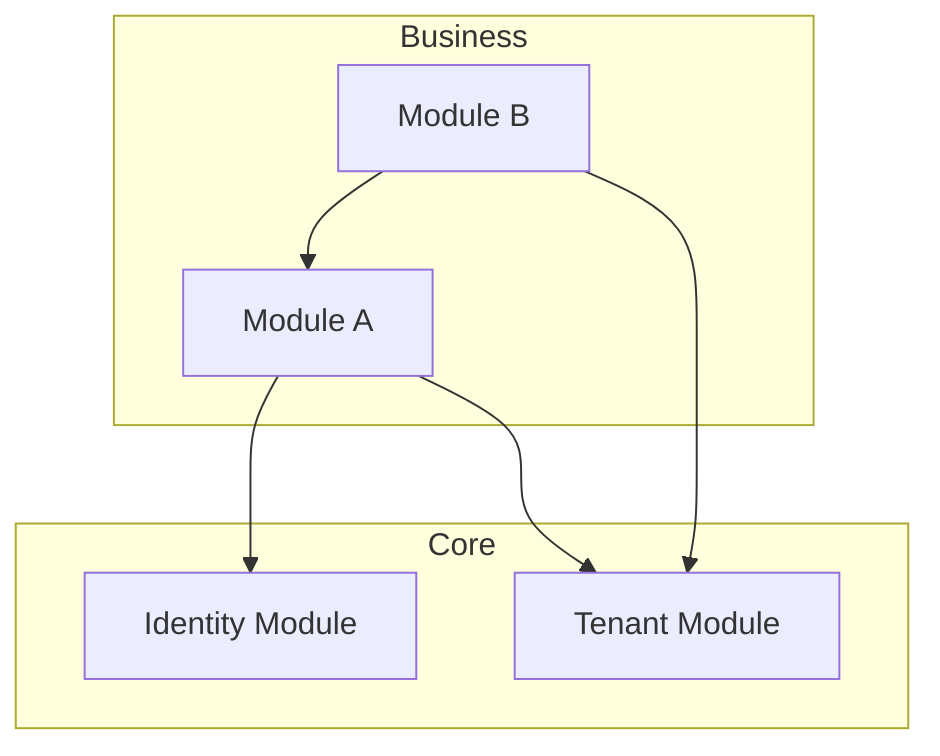

# Step 5: Document Dependencies

Create the complete module catalog with dependency graph and final documentation.

## Dependency Graph Construction

### Step 5.1: Map Dependencies

For each module, document:

```markdown
## Module: {ModuleName}

### Consumes (Dependencies)

| Module | Facade Methods Used | Sync/Async | Purpose |
|--------|---------------------|------------|---------|
| {ModuleA} | {method1}, {method2} | Sync | {why needed} |
| {ModuleB} | {event1} | Async | {why subscribed} |

### Provides (Dependents)

| Module | Methods/Events Consumed | Purpose |
|--------|------------------------|---------|
| {ModuleC} | {method1} | {why they need it} |
```

### Step 5.2: Verify Acyclic Graph

Check for circular dependencies:

- [ ] No direct cycles (A -> B -> A)
- [ ] No indirect cycles (A -> B -> C -> A)

If cycles detected:
1. Document the cycle
2. Propose resolution (event-driven decoupling, shared kernel extraction)
3. Flag as architecture risk

## Dependency Graph Visualization

Generate Mermaid diagram:



## Module Catalog

Create comprehensive catalog:

```markdown
# Module Catalog

| Module | Owner | Purpose | Dependencies | Extraction Readiness |
|--------|-------|---------|--------------|---------------------|
| {name} | {team} | {purpose} | {count} | HIGH/MEDIUM/LOW |
```

## Quality Gate Validation

Verify boundary design quality:

- [ ] All data has clear module ownership
- [ ] No circular dependencies
- [ ] Each module has defined public facade
- [ ] Extraction seams documented
- [ ] All modules have complexity classification
- [ ] Dependency count appropriate for complexity

## Output

Write final artifacts:

1. **Module Boundaries Document**
   - `{output_folder}/planning-artifacts/architecture/module-boundaries.md`

2. **Module Catalog**
   - Embedded in module-boundaries.md or separate file

3. **Dependency Graph**
   - Mermaid diagram in module-boundaries.md

## Final Summary

Present:
- Total modules: {count}
- Dependency graph complexity: {simple/moderate/complex}
- Circular dependencies: {count} (should be 0)
- High extraction readiness modules: {list}
- Recommended implementation order (by dependency depth)

Confirm boundary design is ready for individual module architecture creation.
